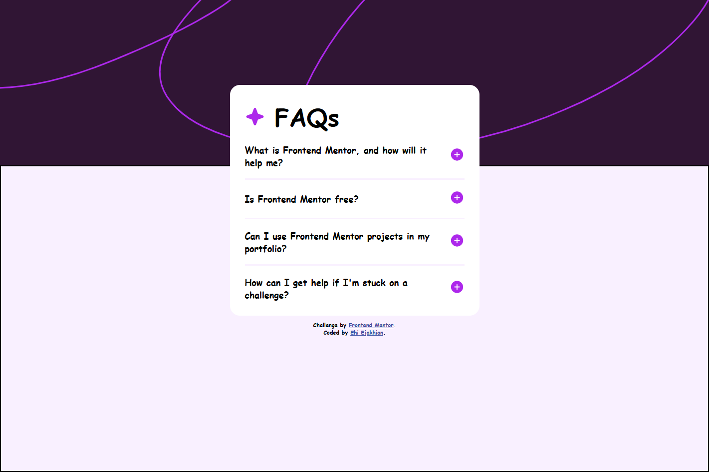

# Frontend Mentor - FAQ accordion solution

This is a solution to the [FAQ accordion challenge on Frontend Mentor](https://www.frontendmentor.io/challenges/faq-accordion-wyfFdeBwBz).


## Table of contents

- [Me](#meet-me)
- [Screenshot](#screenshot)
- [My process](#my-process)
  - [Built with](#built-with)
  - [What I learned](#what-i-learned)
  - [Continued development](#continued-development)
  - [Useful resources](#useful-resources)
- [Acknowledgments](#acknowledgments)
- [Author](#author)
- [Thanks](#thanks)


## Meet Me
Good day. I'm Ehi. I'm an aspiring developer from Edo, Nigeria. I took this challenge. Here's how I did it and thanks for reading!

## Screenshot


## My process
After my HTML, I start styling with padding. I set the margin of all elements to zero and then give all elements borders. This helps me visualize all element boundaries - all this I do without adding any color.

Then, I add color, backgrounds and border radii to the assigned elements. I prefer using Comic Sans MS as my font because it feels relaxing to my eyes and it helps me think better. I can't explain it though, it's just a feeling.

Funny and weird, right?😁

### Built with

- Semantic HTML5 markup
- CSS custom properties
- Flexbox
- CSS Grid

### What I learned
I've learned how to animate the detail elements and target the open state of the details tag.

```css
details::details-content {
    display: block;
    block-size: 0;
    overflow: hidden;
    transition-property: block-size;
    transition-duration: .5s;
    transition-behavior: allow-discrete;
}
details[open]::details-content {
    block-size: auto;
    block-size: calc-size(auto);
}
```
It was really fun!

### Continued development
I want to do better at positioning next time. I need all the help I can get with that.

I also need help suggestions on how to do better at the pattern-image part of the the challenge.

## Acknowledgments
I really want to thank Kevin powell on his video which taught me a great deal on how to customise details and summary tags. Thanks to CSS weekly for also teaching me how to animate them too. Thanks guys.
- [CSS Weekly](https://youtu.be/idoaw75xjhU?si=G7XkdnBEiX-Y-QPT)
- [Kevin Powell](https://youtu.be/Vzj3jSUbMtI?si=l5Accq-EyqoXTr3j)

## Author
For now I don't have a website of my own, but I am working on having one soon. I'll also need all the help I can get on this one. It's very important.
- Frontend Mentor - [@EhiEjakhian](https://www.frontendmentor.io/profile/EhiEjakhian)
- Chat me on Whatsapp - [Ehi Ejakhian](https://wa.me/+2348142340182?text=Hello%20Ehi%20.%20I%20checked%20your%20FAQ%20Accordion%20solution)
- LinkedIn - [Ejakhian Ehi](https://ng.linkedin.com/in/ehi-ejakhian-2302a7318)

I'm also an aspiring comic and sketch artist, so if you have any gigs or if you can relate, check me up on whatsapp and see my art.

# Thanks!
Thank you for going through this. I really hope I did good to your taste, if not please tell me how to improve on the comments section of my solution. Thanks again!


